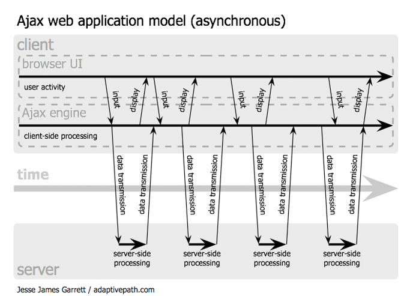

<section>

## Synchronous applications

**Action → Request → HTML response → Action → ...**

1. The user queries a URL
   
   ```http
   GET /action?parameters HTTP/1.1
   ...
   ```

2. The servers replies with some HTML.

3. The user leaves the page by one of the following:
   
   - Clicking a **link**,
   - Clicking a **`submit` button**,
   - **reloading the page**.
   
   ```http
   POST /other_action?parameters HTTP/1.1
   ...
   ```
    
4. The server replies with more HTML.

</section>
<section>

## And the state?

### HTTP is **stateless**

In so-called **Web 1.0** apps, the server is **the only one**
responsible for keeping the state

- In the application logic (URLs, requests, etc.);
- In its local storage (sessions, databases);
- On the client (cookies).

### Action → Request → HTML response → ...

**Collateral damage:** the browser looses the state (except for its
local storage) at each new **action**.

**Demonstration:** <a href="../assets/referrer-echoer.html">surf to
  some other page,</a> then come back.

Time spent on these slides: <span id="date"></span>

<script type="text/javascript">
    var start = new Date();
    setInterval(function () {
      var d = new Date(new Date() - start);
      $('#date').innerHTML = d.getUTCHours() + ":" + d.getUTCMinutes() + ":" + d.getUTCSeconds();
    }, 1000);
</script>

</section>
<section>

## Synchronous browsing


{:.centered}

</section>
<section>

## Synchronous example

<form method='GET' action='http://stackoverflow.com/search'>
**Ask [StackOverflow](http://stackoverflow.com/):**
<input name='q' type='text' value='AJAX' />
<input type='submit' value='Ask' />
</form>

```html
<form method='GET' action='http://stackoverflow.com/search'>
  
  <input name='q' type='text' value='AJAX' />
  <input type='submit' value='Ask' />
</form>
```

</section>
<section>

## Asynchronous browsing


{:.centered}

</section>
<section>

## Asynchronous example

<form id='stack'>
  **Ask [StackOverflow](http://stackoverflow.com/):**
  <input id='query' type='text' value='AJAX' />
  <input type='submit' value='Ask' />
</form>

<div id='answers'></div>
<style>
#answers {
    width: 90%;
    height: 420px;
    margin: auto;
    border: solid thin gray;
    border-radius: 5px;
    box-shadow: 0 0 2px gray inset;
    overflow-y: auto;
    transition: opacity 2s;
    -webkit-transition: opacity 2s;
}
#answers.fadein { opacity: 1; }
#answers.fadeout { opacity: 0.1; }
</style>

</section>
<section>

## Asynchronous browsing

What is needed for asynchronous browsing?

### Action ≠ Request

- JavaScript intercepts user actions (*events*).

### Asynchronous requests (`XMLHttpRequest`, [Fetch API](https://fetch.spec.whatwg.org/))

- JavaScript can initiat a request **independently** from the user
  actions,
- Requests **do not interrupt** browsing.

### *Server push* (`EventSource`, Web sockets)

- The server can send data to the client without waiting for a
  request.

</section>
<section>

## `XMLHttpRequest`

Introduced by Microsoft in IE5, now a W3C standard.

- Sends **POST** or **GET** (and more) requests to the server;
- **Does not block browser** while waiting for the response.
- Runs an **asynchronous callback** when it receives the response.

```js
/***************  Click !  ***************/
mydiv.onclick = function() {
  var xhr = new XMLHttpRequest();
  xhr.open("GET", "../LICENSE");
  xhr.onload = function(event) {
    alert(xhr.response);
  }
  xhr.send();
}
```
{: #ajax-demo}

<style>
#ajax-demo {
  cursor: pointer;
  transition: box-shadow 0.2s;
  -webkit-transition: box-shadow 0.2s;
}
#ajax-demo:hover pre { box-shadow: 0 0 20px blue; }
#ajax-demo.loading pre { box-shadow: 0 0 20px red; }
</style>

<script>
var div = $('#ajax-demo')
div.onclick = function() {
  div.classList.add('loading');
  xhr = new XMLHttpRequest();
  xhr.open("GET", "../LICENSE");
  xhr.onload = function () {
    setTimeout(function() {
      alert(xhr.response);
      div.classList.remove('loading');
    }, 500);
  }
  xhr.send();
}
</script>

</section>
<section>

### Creation and preparation

```js
var xhr = new XMLHttpRequest();
xhr.open("POST", "http://.../action?params");
```

### Callbacks

```js
xhr.onload = function(event) {
  console.log('Success');
}
xhr.onerror = function(event) {
  console.log('Error');
}
xhr.onabort = function(event) {
  console.log("Canceled by the user");
}
xhr.onprogress = function(event) {
  console.log('Downloading...');
}
```

</section>
<section>

### Sending data

```js
xhr.setRequestHeader('Content-Type', 'text/plain')
xhr.send("Hello world !");
```

Emulating a form ([can also send binary
data](https://developer.mozilla.org/en-US/docs/Web/Guide/Using_FormData_Objects))

```js
var formData = new FormData();
formData.append('q', 'AJAX');
formData.append('hl', 'en');
// Content-Type: multipart/form-data  by default
xhr.send(formData);
```

Sending JSON

```js
var data = { primes : [2, 3, 5, 7],
             even   : [2, 4, 6, 8] };
xhr.setRequestHeader('Content-Type', 'application/json');
xhr.send(JSON.stringify(data));
```

</section>
<section class="compacts">

## Reading the response

```js
xhr.onload = function() {
  console.log(xhr.responseText);  // Simple text
  console.log(xhr.responseXML);   // XML (if the response is indeed XML)
  console.log(xhr.response);      // Configurable (text by default)
}
```

Pre-parsing the response

```js
xhr.responseType = "json";
xhr.onload = function() {
  var obj = xhr.response;         // transformed to a JavaScript object
  console.log(obj.toto);          // by the browser
}
```

- `responseType = "text"`: text (default),
- `responseType = "document"`: DOM tree of a HTML document,
- `responseType = "arraybuffer"`, `responseType = "Blob"`: binary data.

</section>
<section>

## Case study: StackOverflow API

<pre><code>document.querySelector('#SO').onsubmit = function(e) {
<div id="xhr-input">  var query = <span class="urlencode">encodeURIComponent</span>(document.querySelector('#query').value);
</div>  var xhr = new XMLHttpRequest();
<div id="xhr-open">  xhr.open('GET', 'https://api.stackexchange.com/2.2/search/advanced'
    + '?q=' + query + '&site=stackoverflow');
</div>
  xhr.onload = callback;
<div class="xhr-json">  xhr.responseType = 'json';
</div>  xhr.send();
<div id="xhr-prevent">  e.preventDefault();
</div>}
</code></pre>

<style>
html[data-incremental="1"] #xhr-input,
html[data-incremental="2"] .urlencode,
html[data-incremental="3"] #xhr-open,
html[data-incremental="4"] .xhr-json,
html[data-incremental="5"] #xhr-prevent
{ outline: solid thick red; }
</style>

- Extracting input field data;
- Escaping special characters;
- Preparing the request for <https://api.stackexchange.com>;
- Waiting for a JSON-formatted response;
- Preventing form submission.
{: .incremental}

</section>
<section>

## Case study: StackOverflow API

<pre><code>var callback = function(e) {
  if (xhr.response && <span class="xhr-parse">xhr.response.<span class="xhr-api">items</span></span>) {
    var liste = <span class="xhr-parse">xhr.response.<span class="xhr-api">items</span></span>;
<div id="xhr-list">    for (var i = 0; i < liste.length; i++) {
      <span class="xhr-dom">document.querySelector('#answers > ul').innerHTML</span> =
        '&lt;li&gt;' + <span class="xhr-parse">liste<span class="xhr-api">[i].title</span></span> + '&lt;/li&gt;';
    }
</div>  } else {
    <span class="xhr-dom">document.querySelector('#answers').innerHTML</span> =
      '&lt;p&gt;Pas de résultats.&lt;/p&gt;';
  }
}
</code></pre>

<style>
html[data-incremental="1"] .xhr-parse,
html[data-incremental="2"] #xhr-list,
html[data-incremental="3"] .xhr-dom,
html[data-incremental="4"] .xhr-api
{ outline: solid thick red; }
</style>

- The (JSON) response is converted to a JavaScript object;
- Building a list of the questions corresponding to our search;
- Inserting the result in the web page through the DOM;
- See the full API documentation: <https://api.stackexchange.com/docs/>.
{: .incremental}

</section>
<section>

## References

- Eloquent Javascript, [Chapter 17](http://eloquentjavascript.net/17_http.html).

- [MDN pages on AJAX](https://developer.mozilla.org/fr/docs/AJAX) (aussi [en anglais](https://developer.mozilla.org/en-US/docs/AJAX)).

- [MDN tutorial on `XMLHttpRequest`](https://developer.mozilla.org/docs/Web/API/XMLHttpRequest/Using_XMLHttpRequest).

- [MDN tutorial on `FormData`](https://developer.mozilla.org/docs/Web/Guide/Using_FormData_Objects).

</section>
