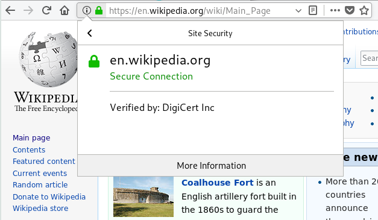
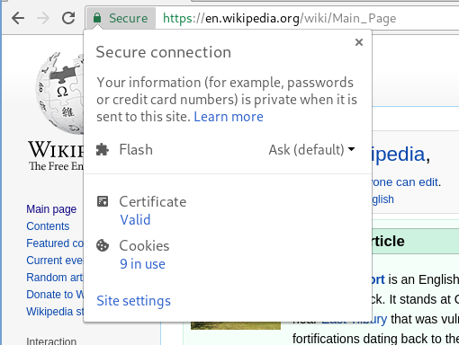
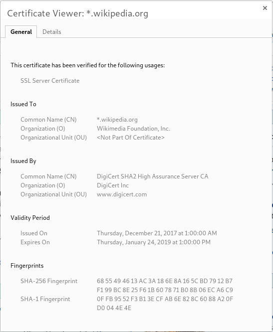

<section>

## HTTPS = HTTP + TLS

### HTTP is an *application-level protocol* (see [TCP/IP model](https://en.wikipedia.org/wiki/Internet_protocol_suite))

- On top of the *transport layer* (TCP),
- Data is sent as text, no cryptographic protection,
- Middle boxes can **intercept, read, block, alter** data:
  - Wiretapping on a local network,
  - Sniffing/injecting wifi packets,
  - Wiretapping internet backbones (e.g., [transatlantic
    cables](https://www.theatlantic.com/international/archive/2013/07/the-creepy-long-standing-practice-of-undersea-cable-tapping/277855/)).

### Transport Layer Security (TLS)

- Adds cryptographic protections above TCP layer: **Confidentiality**,
  **Integrity**, **Authenticity**, **Forward secrecy**.
- First standard: **SSL 1.0**, 1995 (Netscape Communications),
- Latest version: **TLS 1.3**, March 2018.

</section>
<section class="compact">

## Cryptography

From Greek κρυπτoς + γραφειν (*hidden writing*)

**Used for:** secret messages, proving identity, signing digital data,
electronic voting, digital cash, ...

### Security

- Based on **mathematics**:
  - Based on **widely believed** mathematical **assumptions**, most of
    the time;
  - A few constructions based on **theorems**.

- Based on **computational hardness**:
  - Assumes adversary has **bounded computational capacity** /
    **bounded success probability**;
  - Usually bounds are taken much larger than physically possible
    (e.g.: more computation time than the age of the universe /
    smaller probability than presence of active substance in
    homeopathic dilution).

- Based on **secrets**:
  - **keys**, passwords must be **securely stored**.

**Moral of the story**

1. Security is **strong**, but must be **constantly reevaluated**.
2. Theft, operational security failures, law enforcement, social
  engineering are **real threats**!

</section>
<section>

### Symmetric cryptography

- Known since the ancient times: <a id="rot">YBH’IR QBAR VG NF N XVQ</a>.
- Uses **one shared key**, known to all partners.
- Good for:
  - **secret messages** (*encryption*), 
  - signing messages (*message authentication code*).
  
### Asymmetric cryptography

- Known since the '70s.
- Two keys:
  - one **secret key** held by one party, 
  - associated **public key** known to everyone.
- Good for:
  - secret messages (*public-key encryption*), 
  - **proving identity** (*identification*), 
  - **signing messages** (*signatures*),
  - **establishing shared keys** (*key agreement* or *key exchange*).

</section>
<section>

## Cryptographic guarantees in TLS

**Confidentiality**

- Messages are **only intelligible** by client and server;
- Achieved using *symmetric encryption* (e.g., AES).

**Integrity**

- Messages **cannot be altered** by third party;
- Achieved using *symmetric encryption* (e.g., HMAC, GCM).

**Authenticity**

- Client **verifies identity** of the server;
- **Optionally:** server verifies identity of the client;
- Achieved using *asymmetric identification* (e.g, RSA, DSA, ECDSA).

**Forward secrecy**

- Confidentiality maintained even if server/client **keys are later
  compromised** (e.g., stolen, or obtained by law enforcement);
- Achieved using *asymmetric key exchange* (e.g., DH, ECDH);
- Only mandatory in TLS ≥1.3.

</section>
<section>

## How cryptograpy is used in TLS

### Identification <small>(authenticity)</small>

- Server sends a **certificate**, containing its **public key**.
- Clients **validate** the certificate before starting conversation.
- Optionally, clients can send **certificates** too (rare).

### Key exchange <small>(forward secrecy)</small>

- Client and server do a **key exchange** to establish a **session
  key**.
  
### Symmetric encryption <small>(confidentiality, integrity)</small>

- Client and server use **session key** to exchange secret messages.

</section>
<section class="compact">

## Certificates

{:height="230"}

{:height="230"}

- Certificates prove **ownership** of a domain name:
  
  > I'm talking to someone who knows the *secret key* for
  > **en.wikipedia.org**.
  {:.cite}

- Certificates are signed by **certificate authorities**:
  
  > This has fact has been signed for by **DigiCert Inc**.
  {:.cite}

- **Root certificate authorities** are stored in the browser:
  
  > My **browser** tells me to trust DigiCert.
  {:.cite}

</section>
<section>

{:height="550"}
{:.centered}

</section>
<section>

## TLS 1.3: (simplified) technical overview

1. Client sends **ClientHello** to server:
   
   > Hi, I speak TLS 1.2 and TLS 1.3. Here's my **ephemeral
   public key**.
   {:.cite}

2. Server computes **session key** and responds with **ServerHello**:
   
   > Hi, I want to speak TLS 1.3 with you. Here's my **ephemeral
   public key**, encrypted **certificate** and **signature**.
   {:.cite}

3. Client
   
   - Computes **session key**,
   - **validates** certificate,
   - **validates** signature.
   
4. Client and server can start **encrypted HTTP exchange** using the
   **session key**.

</section>
<section>

## Obtaining a TLS certificate

**Certificate authorities** verify that:

- You **own the domain** (you have write access to the site hosted at
  that domain),
- You **know the secret** key for your certificate,
- **Optionally:** you are who you claim to be in real life (address,
  phone number, etc.)
  
If all checks pass, they **sign your certificate**.

### Free certificates

- Domain validation only (no extended validation),
- Free for everyone,
- Automated setup,
- Supports *wildcard* certificates.
- **Goal:** 100% encrypted Web!

</section>
