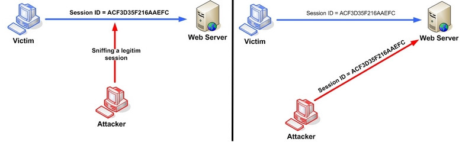

<section class="compact">

## Exemple d'utilisation (risquée) de sessions

~~~
app.get('/login', function (req, res) {
	db.query('SELECT * FROM users WHERE ? AND ?', {
		'id'  : req.query.userid,
		'pwd' : req.query.pwd
	}, function(err, rows) {
		if (rows.length > 0) {
			req.session.loggedin = true;        // on stocke dans la session le fait
			req.session.userid = rows[0].id;    // que l'utilisateur est bien connecté
			req.session.email = rows[0].email;
		}
		...
	});
});

app.get('/reset-pass', function(req, res) {
	if (req.session.loggedin) {            // on vérifie que l'utilisateur est connecté
		db.query('UPDATE users SET pwd=? WHERE id=?',       // on change le mot de passe
			     [ req.query.newpwd, req.session.userid]);  // sans confirmer l'ancien
	}
	...
});
~~~

</section>
<section class="compact">

## Vol de session

Un attaquant connaissant l'identifiant de session peut :

- Agir comme l'utilisateur légitime,
- Forcer l'utilisateur à se déconnecter,
- Potentiellement, lire des données confidentielles,
- (dans l'exemple précédent) changer son mot de passe.

{:#hijack}

Source : <https://www.owasp.org/index.php/Session_hijacking_attack>

</section>
<section>

## Comment connaître l'identifiant

- **Écoute sur le canal →** *Utiliser HTTPS*.
- **Identifiant facile à deviner →** *Utiliser de l'aléa sûr, signer
   cryptographiquement les identifiants*.
- **Fixation →** AAARGH !

### Fixation

1. L'attaquant (*Eve*) fait une requête de connexion, récupère un id
   de session (par ex.: `af31233ax`).

2. L'attaquant convainc la victime (*Alice*) à visiter
   
   ~~~
   http://bob.example.com/login?sessid=af31233ax
   ~~~
   {:.no-highlight}

3. *Alice* se connecte avec son mot de passe, le serveur (*Bob*)
   **associe** la session `af31233ax` **à *Alice*.**

4. *Eve* connaît l'identifiant de session → **Gagné**.

</section>
<section>

## Se protéger de la fixation

- Ne pas accepter des identifiants de session par le *query string* ou
  par des formulaires cachés. → Pas suffisant si d'autres vulnérabilités
  (par ex.: XSS) sont exploitables !

- Renouveler les identifiants de session à chaque connexion.

- Protections CSRF : vérifier que la requête de *Alice* provient d'une
  page appartenant à *Bob*.

- Toujours vérifier l'identité avant de faire des opérations sensibles
  (par ex. : changer le mot de passe).

</section>
<section>

## Lectures

[OWASP](https://www.owasp.org/) sur les sessions :

- [Sur le vol](https://www.owasp.org/index.php/Session_hijacking_attack),
- [Sur la prédiction](https://www.owasp.org/index.php/Session_Prediction),
- [Sur l'interception](https://www.owasp.org/index.php/Man-in-the-middle_attack),
- [Sur la fixation](https://www.owasp.org/index.php/Session_fixation),
  [protections](https://www.owasp.org/index.php/Session_Fixation_Protection)

</section>
