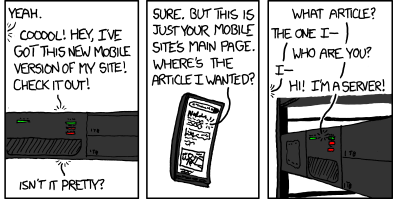

<section>

## Persistance

HTTP est un protocole **sans état**.

### Exemples d'état

Le server se *souvient de l'état* du client entre deux requêtes
(proches ou distantes dans le temps)

- Remplissage de fourmulaires en plusieurs étapes ;
- Navigation avec authentification (webmail, réseau social, ...) ;
- Profil utilisateur ;
- Données *dans le cloud*.

</section>
<section id="xkcd">

<http://xkcd.com/869>

</section>
<section>

## Simuler l'état

HTTP n'a pas de mécanisme natif pour maintenir l'état, mais il peut le
simuler :

Entêtes HTTP
: Authentification HTTP. (Pas courant, difficile à personnaliser).

Persistance GET/POST
: Identifiants de session, protections CSRF, ...

Cookies, Storage API, IndexedDB, WebSQL
: Persistance assurée par le **client**.

Stockage volatile côté server
: Persistance de **courte durée** : *sessions* (dépendant du framework),
*key-value stores* (Memcached, Redis, ...).

Stockage persistant côté server
: Persistance de **longue durée** : système de fichiers, bases de
données (SQL, NoSQL, ...).

</section>
<section>

## Persistance GET/POST

Passer l'état dans les *paramètres* de la requête

### Exemples

Par la *query string*
  
~~~
http://.../profile?user=toto
~~~
{:.bash}

Par l'URL (utilisation du *router*)
 
~~~
http://.../users/toto/profile
~~~
{:.bash}

Par le corps de la requête (de type POST)
 
~~~
POST /profile HTTP/1.1
...

user=toto
~~~
{:.bash}

</section>
<section >

## Persistance GET/POST

### Avantages

- Facile à implanter ;
- Robuste : les browsers ne risquent pas de le bloquer ;
- *Linkability*, *Searchability* : les données sont lisibles dans
  l'URL.

### Désavantages

- Les liens statiques doivent être générés dynamiquement (facilité par
  les templates) ;
- Limité à des données de petite taille.

### Problèmes potentiels de sécurité

Les données sensibles (mots de passe, etc.) ne doivent pas :

- **persister** dans ce canaux.
- **transiter** par l'URL (copier-coller, caches des proxies, ...).
{: style="margin-top:0"}

</section>
<section class="compact">

## Cookies

Couples *clef-valeur* stockés *temporairement* par le *client* **pour
le compte d'un site** (domaine).

- Le server fait la demande avec une entête `Set-Cookie`
  
  ~~~
  HTTP/1.1 200 OK
  ...
  Set-Cookie: user=toto
  ~~~
  {:.bash}

- JavaScript peut aussi demander au browser de stocker un cookie
  (dépassé par la Storage API)
  
  ~~~
  document.cookie = 'user=toto';
  ~~~

- Le browser envoye le cookie dans toute requête **pour le même
  domaine**
  
  ~~~
  GET /app HTTP/1.1
  ...
  Cookie: user=toto
  ~~~

- Les cookies sont stockés et envoyés jusqu'à expiration.

</section>
<section class="compact">

## Cookies et frameworks

En Silex

~~~
use Symfony\Component\HttpFoundation as HTTP;

function handler(HTTP\Request $req) {
  $req->cookies['user'];               // lire les cookies
  $res = new HTTP\Response();
  $res->headers->setCookie(
    new HTTP\Cookie('user', 'toto'));  // écrire un cookie
  $res->headers->clearCookie('user');  // effacer un cookie
}
~~~

En Node.js

~~~
app.use(express.cookieParser());

function handler(req, res) {
  req.cookies.user;                 // lire les cookies
  res.cookie('user', 'toto');       // écrire un cookie
  res.clearCookie('user');          // effacer un cookie
}
~~~

</section>
<section>

## Storage API

- Stockage clef-valeur, introduit avec HTML5,
- API entièrement côté client (JavaScript),
- Dépasse les limitations des cookies sur la taille des données,
- Garanties sur la durée du stockage.
- Deux interfaces, attachées au **domaine** :
  - `sessionStorage` : jusqu'à la fermeture du browser,
  - `localStorage` : persistent.

~~~
if (sessionStorage['user'] === undefined) {
  sessionStorage['user'] = 'toto';
}
delete sessionStorage['user'];
~~~

Plus d'informations : [page du MDN](https://developer.mozilla.org/DOM/Storage).

</section>
<section>

## Stockage par le client

### Utilisations

- **Cookies :** *identifiants de session*, compatibilité,
- **Storage API :** toutes applications, stockage de taille réduite,
- **IndexedDB, WebSQL :** grandes quantités de données.

### Avantages/Désavantages

- Léger pour le serveur, adapté à un site statique.
- Le client peut refuser le stockage.

### Problèmes de sécurité potentiels

- Vol de cookies : compromission de session,
- Ne jamais stocker un *mot de passe maître* chez le client, seulement
  des *mots de passe* éphémères (*identifiants de session*).

</section>
<section>

## Sessions

Sous le nom de **sessions** on regroupe plusieurs techniques pour la
réalisation d'un **stockage éphémère clef-valeur associé à un client**
du côté server.

- Lorsque le client se connecte pour la première fois, l'application
  lui associe un **identifiant de session**. Cet identifiant peut être
  stocké et transmis par l'une des méthodes vues auparavant.

- Lorsque la session est créée, un **stockage clef-valeur éphémère**
  est mis en place sur le server (*fichier temporaire*, *mémoire*,
  *base de donnée*, ...)
 
- À chaque requête qui suit, le framework charge dans l'objet
  *Requête* le contenu de la session.

</section>
<section>

## Sessions à la PHP

{:width="700"}
{:.centered}

</section>
<section>

## Sessions par cookie chiffré

- Données de session stockées dans un cookie chez le client ;
- Cookie protégé cryptographiquement :
  - Chiffrement pour la confidentialité (optionnel) ;
  - [HMAC](http://en.wikipedia.org/wiki/Hash-based_message_authentication_code)
    pour l'intégrité et l'authenticité ;
- La clef secrète (symétrique) est connue et utilisée exclusivement
  par le server.

</section>
<section class="compact">

## Sessions en Silex

~~~
// Configuration
$app->register(new Silex\Provider\SessionServiceProvider());

$app->get('/welcome',
  function(Application $app, Request $req) {
    // On stocke dans la session
    $app['session']->set('user', $req->query->get('name'));
    ...
});

$app->get('/next', function(Application $app) {
  // On cherche dans la session
  $u = $app['session']->get('user');
  if ($u) {
    return 'Hello ' . $u;
  } else {
    // Si user n'est pas défini, or rédirige sur /welcome
    return $app->redirect('/welcome');
  }
});
~~~

</section>
<section class="compact">

## Sessions en Express

~~~
// Configuration (utilise un cookie signé, non chiffré)
app
  .use(express.query())
  .use(express.cookieParser())
  .use(express.session( { secret : '12345' } ));

app.get('/welcome', function (req, res) {
  // On stocke dans la session
  req.session.user = req.query.user;
  ...
});

app.get('/next', function (req, res) {
  // On cherche dans la session
  if (req.session.user) {
    res.end('Hello ' + req.session.user);
  } else {
    // Si user n'est pas défini, or rédirige sur /welcome
    res.redirect('/welcome');
  }
});
~~~

</section>
<section>

## Sessions

### Avantages

- API transparente, cache les détails du protocole et de
  l'implantation.
- Souvent plus rapide qu'une interrogation d'une BD.

### Désavantages

- Utilise davantage de ressources du server.
- Quasiment toutes les implantations nécessitent des cookies.

### Alternatives et compléments

Systèmes de stockage global pour l'application

- Clef-valeur en mémoire : Redis, ...
- *Big table* : Memcached, ...

</section>
<section>

## Quelques conseils de sécurité

**Ne pas stocker de données sensibles non chiffrées chez le client**,
  ne pas les transmettre en clair par l'URL.

**Générer des identifiants de session difficiles à deviner :**
  utiliser des générateurs aléatoires et beaucoup de caractères.
  
**Chiffrer les sessions critiques :** transmettre exclusivement par
  HTTPS les informations sensibles.

Un attaquant qui peut **voler** un cookie de session peut accéder à
**toutes les données** de l'utilisateur.

**Donner des durées de vie limitées :** les cookies de session, les
  identifiants, ... devraient périmer rapidement (ou régulièrement).
  
**Demander une confirmation avant toute opération critique :** par
  ex., redemander le mot de passe avant de transférer de l'argent vers
  un compte bancaire !

**ET TOUJOURS VÉRIFIER LES DONNÉES DU CLIENT !**
{:.centered}

</section>
<section>

# Stockage persistant

</section>
<section>

## Stockage persistant

Toute application web nécessite de stocker des données de façon
**permanente** sur le **server**.

- Système de fichiers : **SQLite**, ...
- BDs SQL : **MySQL**, **PostgreSQL**, ...
- BDs NoSQL : **MongoDB**, **Couchbase**, **CouchDB**, ...

### Abstractions

Tous les frameworks offrent des modules pour faciliter l'interaction
avec les bases de données :

- **DBAL (Database Abstraction Layer) :** accès à plusieurs systèmes
  de BD (par ex., MySQL, SQLite, ...)  avec une API unique.
- **ORM (Object Relational Mapping) :** traduction entre objets du
  langage du framework et entités de la BD.

</section>
<section>

## Rappels sur MySQL

Lire une table

~~~
SELECT * FROM users WHERE id = 'toto';
~~~

Écrire dans une table

~~~
UPDATE users SET pwd = 'SHA1(12345)'
WHERE id = 'toto';
~~~

### Resources

La référence MySQL complète

> <http://dev.mysql.com/doc/refman/5.0/en/>

Un tutoriel rapide et complet, avec exemples

> <http://www.w3schools.com/sql/>

</section>
<section>

## Silex et MySQL

PHP fournit deux modules pour l'accès aux bases MySQL :

- [mysqli](http://www.php.net/manual/book.mysqli.php) (spécifique pour MySQL),
- [PDO](http://www.php.net/manual/book.pdo.php) (DBAL générique).

Silex ajoute son propre DBAL par dessus PDO :
[Doctrine](www.doctrine-project.org/projects/dbal.html).

### Fonctionnalités

- Connexion à une base de donnée (distante),
- Interrogations SQL, parcours des résultats,
- *Requêtes préparées*,
- *Query builder*,
- Transactions,
- ...

</section>
<section>

## Doctrine

Activer Doctrine et se connecter à la base

~~~
use Silex\Provider\DoctrineServiceProvider;

$app->register(new DoctrineServiceProvider(),
  array('db.options' => array(
            'driver'   => 'pdo_mysql',
            'host'     => 'localhost',
			'user'     => 'toto',
			'password' => '12345'
    ),
));
~~~

Plus sur la configuration:

- [Dans le manuel de Silex](http://silex.sensiolabs.org/doc/providers/doctrine.html),
- [Dans le manuel de Doctrine](http://docs.doctrine-project.org/projects/doctrine-dbal/en/latest/reference/configuration.html).

</section>
<section>

Faire une requête

~~~
$q = $app['db']->executeQuery('SELECT * FROM users');
~~~
{:.php}

Parcourir le résultat (en le copiant dans un tableau PHP)

~~~
$results = $q->fetchAll();
foreach ($results as $row) {
  $row['name'];
}
~~~

ou (ligne par ligne)

~~~
while ($row = $q->fetchAssoc()) {
  $row['name'];
}
~~~
{:.php}

Tout en un

~~~
$app['db']->fetchAll('SELECT * FROM users');
~~~
{:.php}

Plus de fonctions dans le
[manuel](http://docs.doctrine-project.org/projects/doctrine-dbal/en/latest/reference/data-retrieval-and-manipulation.html).

</section>
<section>

## MySQL pour Node.js

Installer le module [mysql](https://github.com/felixge/node-mysql)

~~~
npm install mysql
~~~

Configurer

~~~
var mysql = require('mysql');
var db    = mysql.createConnection({
  host     : 'localhost',
  user     : 'toto',
  password : '12345'
});
~~~

Plus d'options : <https://github.com/felixge/node-mysql>

</section>
<section>

Faire une requête

~~~
db.query('SELECT * FROM users',
  // callback
  function(err, rows) {
    if (!err) {
      for (var i = 0 ; i < rows.length ; i++) {
        console.log(rows[i]);
      }
	}
  });
~~~

**Attention :** Node.js a un modèle d'exécution **asyncrhone**. Le
résultat de la requête est passé à une **callback**.

#### Autres interfaces de BD pour Node.js

- **SQLite :** [`sqlite3`](https://npmjs.org/package/sqlite3) ;
- **Postgres :** [`pg`](https://npmjs.org/package/pg) ;
- **MongoDB :** [`mongoose`](http://mongoosejs.com/) ;
- **Autres**
  [`connect-sqlite3`](https://npmjs.org/package/connect-sqlite3)
  (mécanisme de sessions), ...

</section>
<section>

# Échappement

</section>
<section>

## Échappement SQL

On a avec SQL le même problème déjà vu avec HTML

~~~
function (Application $app, Request $req) {
  $app['db']->query(
    'SELECT * FROM users WHERE id = \''
    . $req->query->get('nom') . '\';' );
}
~~~

Les caractères spéciaux SQL `` ` ``, `'`, `"`, `;` doivent être
**échappés**.

La syntaxe de l'échappement dépend de la base de données (MySQL,
PostgreSQL, ...)

Fonctions d'échappement:

- PHP : `mysqli::real_escape_string`,
- PDO/Doctrine : `PDO::quote`, `Doctrine::quote`,
- Échappement automatique : **requêtes préparées**.

</section>
<section>

## Requêtes préparées

En Silex

~~~
$app['db']->fetchAssoc(
  "SELECT * FROM users WHERE id = ?",
  array($req->query->get("nom")));
~~~

~~~
$app['db']->fetchAssoc(
  "SELECT * FROM users WHERE id = :name",
  array(':name' => $req->query->get("nom")));
~~~

En Node.js avec `mysql`

~~~
db.query('SELECT * FROM users WHERE id = ?',
         [ req.query.nom ],
		 function() {
           ...
         });
~~~

</section>
<section>

## Lectures

#### Stockage client

- [DOM Storage Guide](https://developer.mozilla.org/DOM/Storage).

#### Sessions

- [En Silex](http://silex.sensiolabs.org/doc/providers/session.html),
- [En Express](http://www.senchalabs.org/connect/session.html).

#### DBAL pour PHP

- [Manuel de mysqli](http://www.php.net/manual/book.mysqli.php),
- [Manuel de PDO](http://www.php.net/manual/book.pdo.php),
- [Manuel de Doctrine](http://docs.doctrine-project.org/projects/doctrine-dbal/) (en anglais).

#### MySQL pour Node.js

- [Manuel de `mysql`](https://github.com/felixge/node-mysql) (en anglais).

</section>
